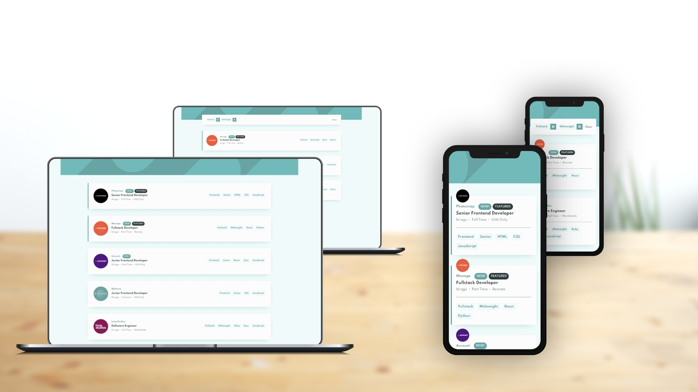

# Job listings with filtering

This is a solution to the [Job listings with filtering challenge on Frontend Mentor](https://www.frontendmentor.io/challenges/job-listings-with-filtering-ivstIPCt). Frontend Mentor challenges help you improve your coding skills by building realistic projects. 

## Table of contents

- [Job listings with filtering solution](#job-listings-with-filtering-solution)
  - [Table of contents](#table-of-contents)
  - [Overview](#overview)
    - [The challenge](#the-challenge)
    - [Screenshot](#screenshot)
    - [Links](#links)
  - [Front-end Style Guide](#front-end-style-guide)
    - [Layout](#layout)
    - [Colors](#colors)
    - [Typography](#typography)
  - [My process](#my-process)
    - [Built with](#built-with)
  - [Author](#author)

## Overview

### The challenge

Users should be able to:

- View the optimal layout for the site depending on their device's screen size
- See hover states for all interactive elements on the page
- Filter job listings based on the categories

### Screenshot

### Links

- Live Site URL: [https://benjaminvillatte.github.io/fem-static-job-listings/](https://benjaminvillatte.github.io/fem-static-job-listings/)

## Front-end Style Guide

### Layout

The designs were created to the following widths:

- Mobile: 375px
- Desktop: 1440px

### Colors

_Primary_

- Desaturated Dark Cyan: hsl(180, 29%, 50%)

_Neutral_

- Light Grayish Cyan (Background): hsl(180, 52%, 96%)
- Light Grayish Cyan (Filter Tablets): hsl(180, 31%, 95%)
- Dark Grayish Cyan: hsl(180, 8%, 52%)
- Very Dark Grayish Cyan: hsl(180, 14%, 20%)

### Typography

_Body Copy_

- Font size: 15px

_Headings_

- Family: [Spartan](https://fonts.google.com/specimen/Spartan)
- Weights: 500, 700

## My process

### Built with

- Semantic HTML5 markup
- CSS custom properties
- Flexbox
- Mobile-first workflow
- [Vue.js 3](https://vuejs.org/) - JS library
- [VueX 4](https://vuex.vuejs.org/) - JS library

## Author

- Website - [Benjamin VILLATTE](https://www.benjaminvillatte.fr)
